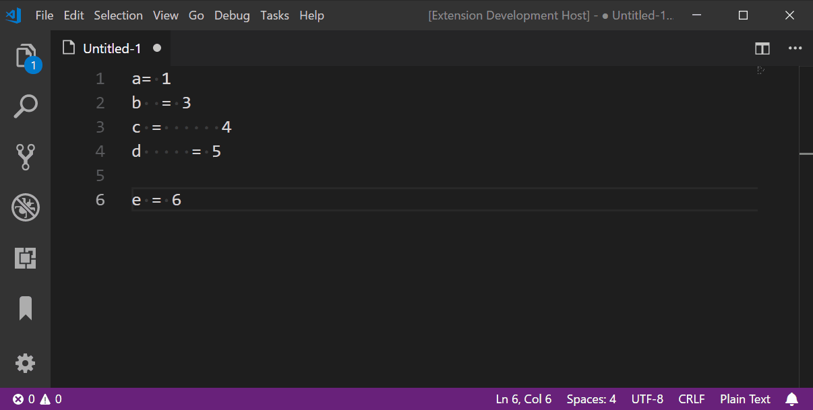
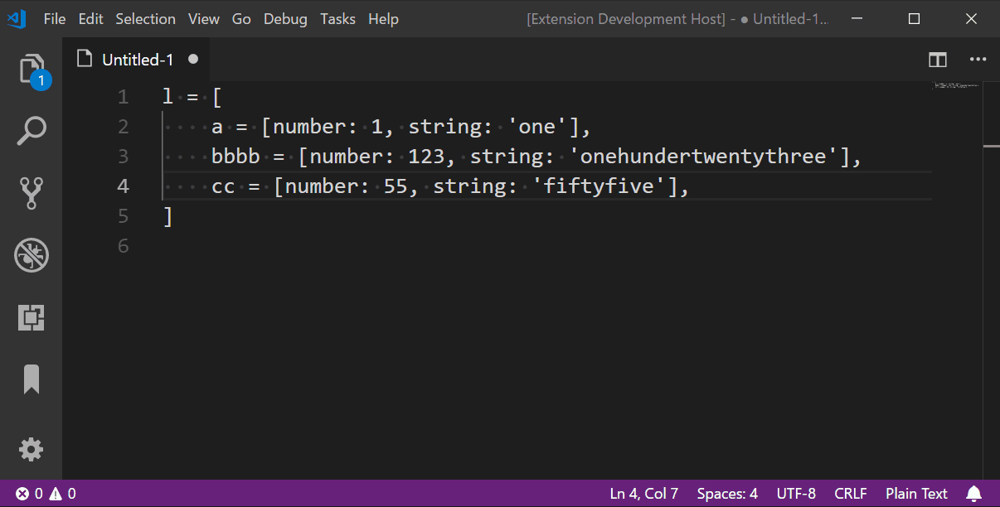

# align-by-regex README

With this extension multiple lines of text can be aligned by a regular expression.

## Features

- Align multiple lines of text by regular expressions.
- Store regular expressions as templates for repeated use (Usage: Type the name of the template instead of the regular expression).

## Examples





## Extension Settings

This extension contributes the following settings:

* `align.by.regex.templates`: Map which can hold user specified regular expression templates (i.e.)   
default configs:   
```json
"align.by.regex.templates": { 
    "sql": {
        "alignRegExp": [
            "^(\\s*)(`\\w+`)(\\s)\\s*",
            "$+^(?:((?:(?!NOT)(?!NULL)(?!DEFAULT)[^\\s])+)(\\s|$)\\s*)?",
            "\\s*(NOT\\s)?\\s*(NULL)?(\\s)?\\s*(.*)"
        ],
        "startRegExp": "^\\s*CREATE\\s+TABLE\\s+.*",
        "endRegExp": "^.*\\)\\s?ENGINE\\s*="
    },
    "eq": {
        "alignRegExp": [
            "^(\\s*)([^=\\s]+)",
            "+^(?:(\\s)?\\s*([^=\\s]+))?",
            "^(\\s)?\\s*(=)(\\s)?\\s*(.*)"
        ]
    },
    "sp": {
        "alignRegExp": [
            "(^\\s*)([^\\s]+)",
            "+(?:(\\s)\\s*([^\\s]+))?"
        ]
    }
 }
 ``` 
 sql: 对齐sql ddl 字段；  
 eq:  对齐等号两边；  
 sp:  以空格为分割，对齐所有内容;  

```
 alignRegExp 配置原则。按正则匹配组的顺序，对齐每个分组的内容，较短分组内容右侧添加空格补齐。
 没有在分组中的匹配内容将丢弃。  
 配置了多个 正则式，则按数组顺序 执行每个正则表达式的匹配，匹配后并剪短剩余 行内容再进入下一个正则的匹配，
 其中任意一个正则不能匹配，则整行不作处理，跳过本行。 而每个正则表达式的匹配， 如果表达式以约定的特殊标记
 字符“+”开头，则采取贪婪模式，反复循环截断再匹配，直到没有匹配到为止。否则，一个表达式只匹配一次截断一次，
 就到下一个表达式匹配。   如果表达式以约定的特殊标记字符 “$”开头，则表该表达式下，最后匹配到的分组最后合
 并成一个，包括贪婪模式下的所有循环次数而来的多个分组结果也合并成一个。 “$” 与 “+” 同时使用时，“$” 必须
 要在前， 如：“$+”  

当光标没有选择内容时，则全文档对齐，否则只对光标选择的行进行对齐。配置了  startRegExp 及 endRegExp 才
可以全文档对齐。
startRegExp 匹配执行对齐的同一组文本内容的起始行。
endRegExp 匹配执行对齐的同一组文本内容的结束行。
全文档对齐时，其中处于不同一组的内容，各自独立地对齐，不同组间对齐宽度不相同。
如果不能匹配到起始行或结束行，则该组内容无法进行对齐。

 ```

## Contributors

* [Carl](https://github.com/softwareape)

## Release Notes

### 1.0.4

Fixed an error which could lead to missing spaces in some cases.

### 1.0.3

Fixed an error which could lead to an infinite loop.
Fixed an error, introduced in 1.0.2, which could break alignment in some cases.

### 1.0.2

Multiple alignment isses have been fixed.

### 1.0.1

Minor Bugfixes.

### 1.0.0

Initial release of align-by-regex.
